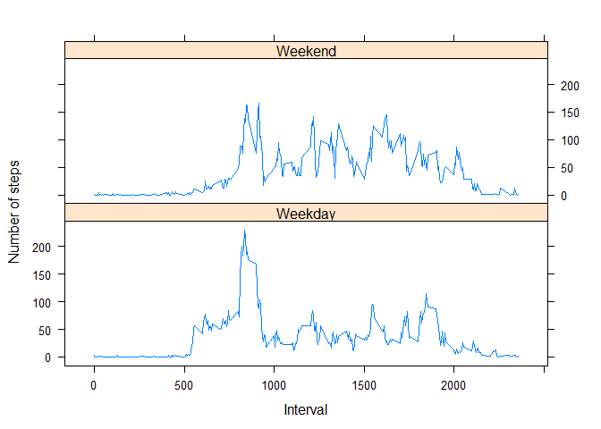

# Reproducible Research: Peer Assessment 1
Victor Herrera Cordova  
Thursday May 14, 2015  

### Loading and preprocessing the data

Show any code that is needed to

1. Load the data (i.e. `read.csv()`)

2. Process/transform the data (if necessary) into a format suitable for your analysis


```r
rawData <- read.csv(unz("activity.zip", "activity.csv"), colClasses = c("integer", "Date", "integer"))
```


### What is mean total number of steps taken per day?

For this part of the assignment, you can ignore the missing values in
the dataset.

1. Make a histogram of the total number of steps taken each day


```r
perDay<-aggregate(steps ~ date, rawData, sum)
hist(perDay$steps, breaks = 20, xlab = "number of steps", main = "Total Steps per Day")
abline(v = mean(perDay$steps), col="red")
```

 

2. Calculate and report the **mean** and **median** total number of steps taken per day


```r
perDay_mean   <- mean(perDay$steps)
perDay_mean
```

```
## [1] 10766.19
```

```r
perDay_median <- median(perDay$steps)
perDay_median
```

```
## [1] 10765
```


### What is the average daily activity pattern?

1. Make a time series plot (i.e. `type = "l"`) of the 5-minute interval (x-axis) and the average number of steps taken, averaged across all days (y-axis)


```r
perInt<-aggregate(steps ~ interval, rawData, mean)
library(lattice)
xyplot(steps~interval, data= perInt, type = "l", xlab = "Interval", ylab ="Number of steps")
```

 

2. Which 5-minute interval, on average across all the days in the dataset, contains the maximum number of steps?


```r
perInt[perInt$steps==max(perInt$steps), "interval"] ## contains the maximum number of steps
```

```
## [1] 835
```

* Answer: Interval 8:35 has the maximum number of steps.

### Imputing missing values

Note that there are a number of days/intervals where there are missing
values (coded as `NA`). The presence of missing days may introduce
bias into some calculations or summaries of the data.

1. Calculate and report the total number of missing values in the dataset (i.e. the total number of rows with `NA`s)


```r
nrow(rawData[is.na(rawData$steps),])  ## number of NA in raw data
```

```
## [1] 2304
```

2. Devise a strategy for filling in all of the missing values in the dataset. The strategy does not need to be sophisticated. For example, you could use the mean/median for that day, or the mean for that 5-minute interval, etc.  

#### Strategy:  
- Filling the missing values with the Mean of the number of steps for that 5-minute interval (function repstep).


```r
## function that returns the mean of steps per day for a given interval
repstep<- function(x){ return(perInt[which(perInt$interval == x),2])} 
```

3. Create a new dataset that is equal to the original dataset but with the missing data filled in.


```r
fitData<- rawData
## replacing NA steps with avg steps per day
fitData[is.na(fitData$steps),1] <- sapply(fitData[is.na(fitData$steps),3], repstep)
nrow(fitData[is.na(fitData$steps),])  ## number of NA on fitted data
```

```
## [1] 0
```

4. Make a histogram of the total number of steps taken each day and Calculate and report the **mean** and **median** total number of steps taken per day. 


```r
perDayfit<-aggregate(steps ~ date, fitData, sum)
hist(perDayfit$steps, breaks = 20, xlab = "number of steps", main = "Total Steps per Day - Fitted data")
perDayfit_mean   <- mean(perDayfit$steps)
perDayfit_median <- median(perDayfit$steps)
abline(v = perDayfit_mean, col="red")
text(perDayfit_mean,8,paste("mean    = ", round(perDayfit_mean), sep=""), pos = 4)
text(perDayfit_mean,7,paste("median = ", round(perDayfit_median), sep=""), pos = 4)
```

 

```r
perDayfit_mean
```

```
## [1] 10766.19
```

```r
perDayfit_median
```

```
## [1] 10766.19
```
  
    
Do these values differ from the estimates from the first part of the assignment?  

* Answer: The mean is equal, the median changed. However, the change in the median is less than 0.01%.  

What is the impact of imputing missing data on the estimates of the total daily number of steps?  

* Answer:  The frequency values changed because the imputed values, however, the distribution center did not change. It is still centered at 10766 steps.  
  
  
### Are there differences in activity patterns between weekdays and weekends?

For this part the `weekdays()` function may be of some help here. Use
the dataset with the filled-in missing values for this part.  

1. Create a new factor variable in the dataset with two levels -- "weekday" and "weekend" indicating whether a given date is a weekday or weekend day.


```r
weekend<- function(x){ return(if (weekdays(x) == "Saturday" || weekdays(x) == "Sunday") {"Weekend"} else {"Weekday"})}
weekData <- data.frame(fitData, dayType = sapply(fitData$date, weekend))
```

2. Make a panel plot containing a time series plot (i.e. `type = "l"`) of the 5-minute interval (x-axis) and the average number of steps taken, averaged across all weekday days or weekend days (y-axis).


```r
perIntWeek<-aggregate(steps ~ interval+dayType, weekData, mean)
xyplot(steps~interval|dayType, data=perIntWeek, type='l', layout=c(1, 2), xlab = "Interval", ylab ="Number of steps")
```

 
  
Are there differences in activity patterns between weekdays and weekends?  

* Answer: There are differences between activity patterns:  
1. weekdays are more active than weekends early morning from around 5am to 8am
2. weekends are more active than weekdays after 10am, except from around 6pm to 7pm  

#### VHC 2015
